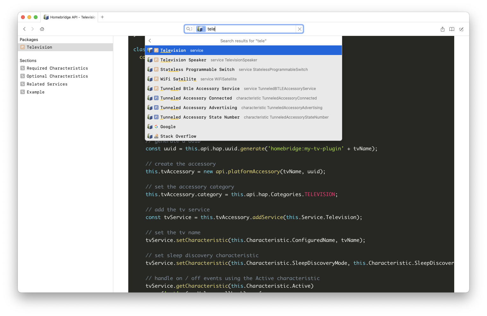

# Dash docset for homebridge.io

Auto-generated from the docs that are available at https://developers.homebridge.io/



## Download

Download the [latest docset](https://github.com/dvcrn/dash-docset-homebridge/releases/latest) from Releases section

## Building yourself

For building the docset, you need to have [dashing](https://github.com/technosophos/dashing) installed.

For actually downloading and building the docset:

```
npm run download-docs
npm run generate-docset
```

## Notes

There is probably a smarter way of doing this by just using services.json + characteristics.json that the website itself uses for generation.
